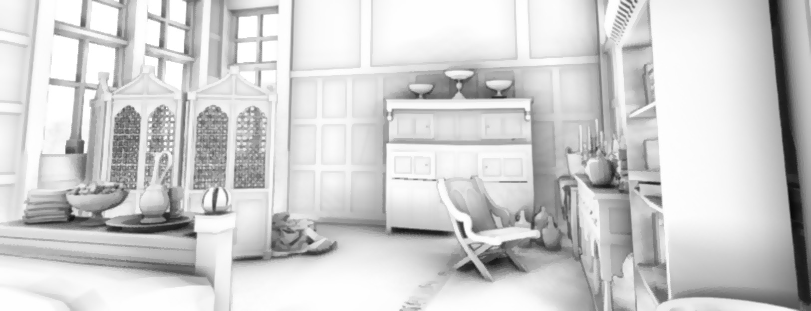
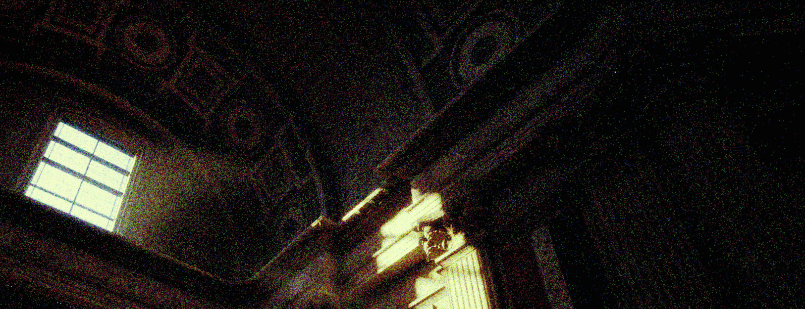
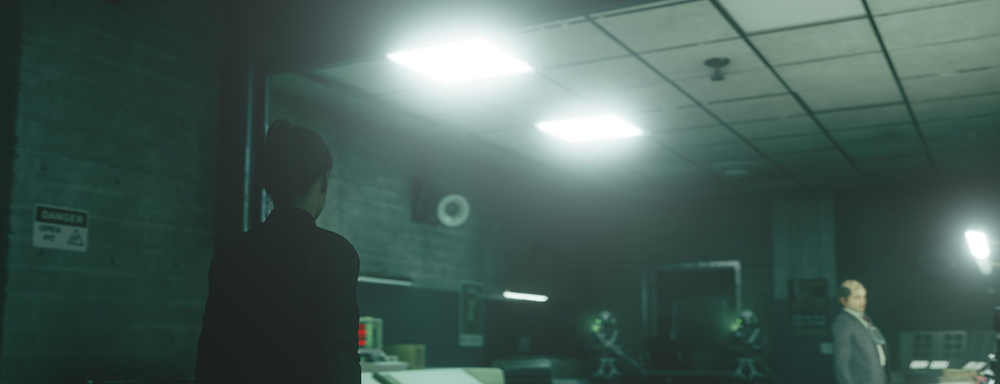
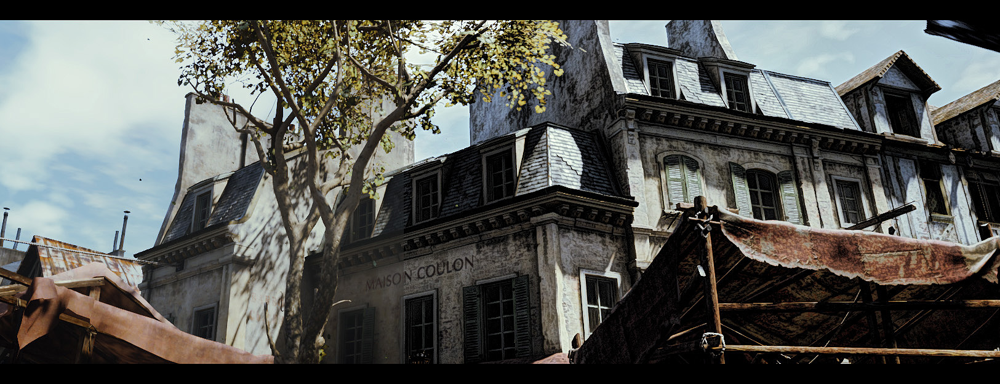
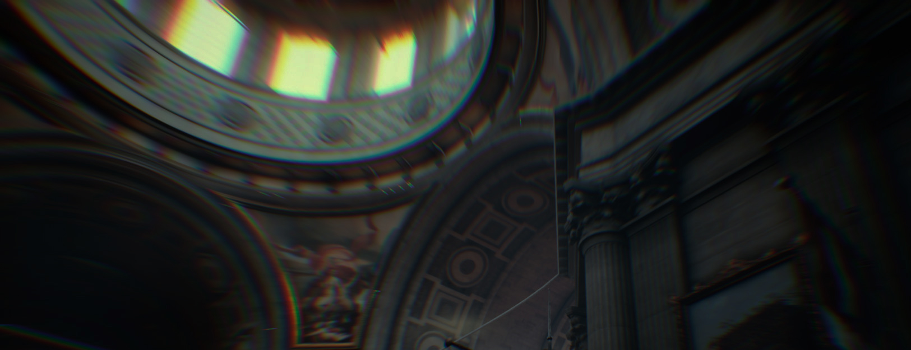
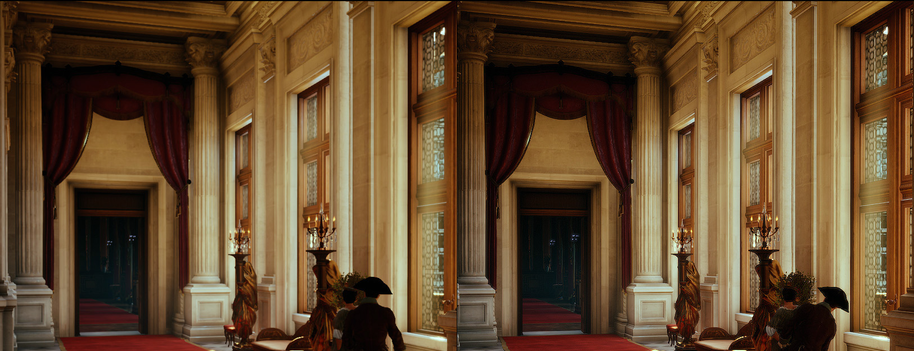

UNiT is a technically advanced and physically-inspired post-processing shader library for ReShade with optimization for real-time usage.

## **INCLUDED EFFECTS**:

### **A-GTVBAO: Analytical Ground-Truth Ambient Occlusion with Visibility Bitmask**

A modern screen-space ambient occlusion algorithm using analytic integration over the horizon using a bit-field masking, allowing for precise geometry/object occlusion of almost any scene.

### **Stochastic Filmic Grain: Fast Physically Correct Filmic Grain**

A fully physically based film grain model that operates on the principle of the Poisson distribution, which is the same principle that silver crystals in film emulsions obey.

### **Luminescence (Lumi-Bloom): Technically Advanced Lens Light Scattering**

Simulation of the real process of light diffusion using several new techniques, which gives a pure-natural glow from point lights.

### **F-LLF: Fast Local Laplacian Filtering**

A visually correct implementation of the image local contrast enhancement algorithm based on the Fast Local Laplacian Filtering method, adapted for real-time usage.

### **Spectral CA: Chromatic Aberration via Spectrum Integration**

Simulating of the realistic prism dispersion by using continuous spectrum integration over the wavelength.

### **Frequency Sharpen: Frequency-Domain Detail Restoration Technique**

An image sharpening method that uses frequency transform principles to highly accurate restore detail and enhance overall image detailing without contrast changing and halos. 

 

Copyright (c) RG2PS. All Right Reserved.

